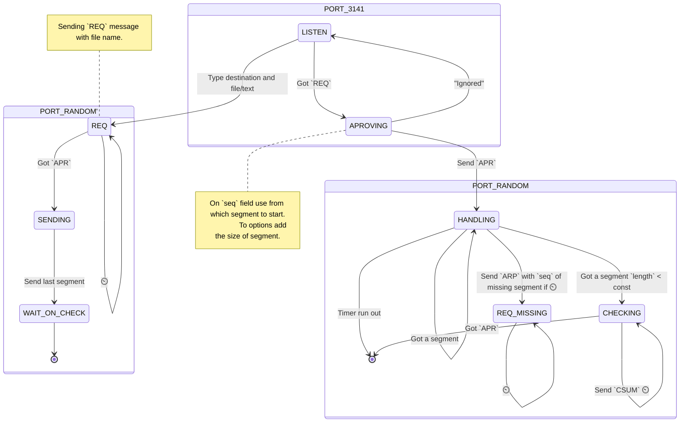

- [ ] 📅 2023-12-04

--- 

- [ ] Handling data lost
- [ ] Handling error detection
- [ ] Change fragment size from receiver
    - Max fragment size to not be fragmented on Data-Link layer
- [ ] Communication is closed only by hand
- [ ] Debugging
    - Fragmented with SEQ number
    - If errored
    - On success tell where

## Segment structure

1472 bytes (1500 - 8 bytes for UDP header and 20 bytes for IPv4 header)

## ...

### ARQ (Automatic Repeat reQuest)

The idea to ACK only non-successful packets (NACKs). And the last one fragment ACK with _code_ that might be made only
by getting all fragments of file.

## State machine

## linked W

- [Learning by practicing: Calculating the TCP Checksum, with a taste of scapy + Wireshark (securitynik.com)](https://www.securitynik.com/2015/08/calculating-udp-checksum-with-taste-of_3.html)
- [Python, how to read bytes from file and save it? - Stack Overflow](https://stackoverflow.com/questions/6787233/python-how-to-read-bytes-from-file-and-save-it)

4b9f1fb1fe7747ea6235ed06ea4babc88bf2a92ea22d2a8c6cc622dcefcbbf2c