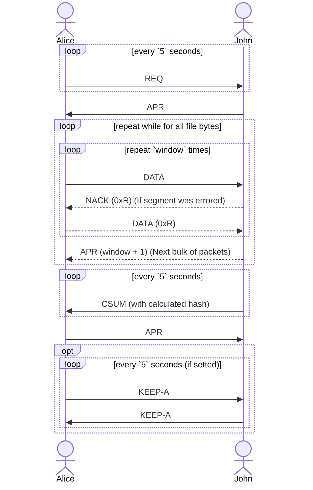

- [ ] 📅 2023-12-04
- [ ] 📅 2023-11-19 navbar

--- 

- [ ] Handling data lost
- [ ] Handling error detection
- [ ] Change fragment size from receiver
    - Max fragment size to not be fragmented on Data-Link layer
- [ ] Communication is closed only by hand
- [ ] Debugging
    - Fragmented with SEQ number
    - If errored
    - On success tell where

## Header Structure

_1472 bytes (1500–8 bytes for UDP header and 20 bytes for IPv4 header)_.

The header structure itself will not be absolute and will be modified with respect to the type of segment being
forwarded. Because of the logic of this protocol, it will not affect in any area if a packet arrives with a different
type.

| REQ (0x011) | Checksum | Hash     | Window size | Filename |
|-------------|----------|----------|-------------|----------|
| 3 bits      | 21 bits  | 256 bits | 8 bits      | ...      |

---

| REQ_M (0x010) | Checksum | Window size |
|---------------|----------|-------------|
| 3 bits        | 21 bits  | 8 bits      |

---

| Data (0x000) | Checksum | SEQ Number | Data |
|--------------|----------|------------|------|
| 3 bits       | 21 bits  | 32 bits    | ...  |

---

| APR (0x100) | Checksum | SEQ Number | 
|-------------|----------|------------|
| 3 bits      | 21 bits  | 32 bits    | 

---

| NACK (0x101) | Checksum | SEQ Number | 
|--------------|----------|------------|
| 3 bits       | 21 bits  | 32 bits    | 

---

| CSUM (0x111) | Checksum | Hash     | 
|--------------|----------|----------|
| 3 bits       | 21 bits  | 256 bits | 

---

| KEEP-A (0x110) |  
|----------------|
| 3 bits         | 

---

- **SEQ Number**
    - Used to mark segment with unique identification.
    - _32 bits -> 2^32 = 4,294,967,296 segments to send_.
      _1472 - (21+32+3) = 1465_.
      _4,294,967,296 * 1465 ~ **6.25 GB is maximum**_.
- **Checksum**
    - **21 bits** checksum field used to avoid any hash error in sending large files.
    - _Will be used "Internet
      Checksum":
      [Calculating the Checksum,
      with a taste](https://www.securitynik.com/2015/08/calculating-udp-checksum-with-taste-of_3.html)_.
- **Hash**
    - This header field will be used to check if a document is gotten properly right. It Would be used by REQ and CSUM.
    - Also, it might be used as **unique identification** for certain files.
        - _If sending the file was interrupted - the receiver might request the remain segments (start from last
          received one)_.
    - _Will be used the BLAKE3 algorithm [cryptographic hash function](https://github.com/BLAKE3-team/BLAKE3)_.

## ARQ Method

In the pursuit of optimizing the sending of the file, I have chosen the idea of using a negative acknowledgement
number and acknowledge a specific group of packets.

**Acknowledging a specific group of packets** implies that after the sender transmits a window size of packets, it
awaits a positive acknowledgment (ACK) from the receiver confirming the successful reception of that particular batch or
group of packets before proceeding with further transmissions.

While receiving packets, the **receiver has the capability to flag certain packets as erroneous**, requesting their
retransmission, all the while concurrently continuing to receive subsequent packets in parallel.

## The user journey



%% ## State machine

```mermaid
stateDiagram-v2
    state PORT_3141 {
        LISTEN --> REQ: Type destination and file/text
        LISTEN --> APROVING: Got `REQ`
        APROVING --> LISTEN: "Ignored"
        APROVING --> HANDLING: Send `APR`
        note right of APROVING
            On `seq` field use from which segment to start.
            To options add the size of segment.
        end note
    }

    state PORT_RANDOM {
        HANDLING --> [*]: Timer run out
        HANDLING --> HANDLING: Got a segment
        HANDLING --> REQ_MISSING: Send `ARP` with `seq` of missing segment if ⏲️
        REQ_MISSING --> REQ_MISSING: ⏲️
        HANDLING --> CHECKING: Got a segment `length` < const
        CHECKING --> CHECKING: Send `CSUM` ⏲️
        CHECKING --> [*]: Got `APR`
    }

    state PORT_RANDOM' {
        REQ --> REQ: ⏲️
        note left of REQ
            Sending `REQ` message with file name.
        end note
        REQ --> SENDING: Got `APR`
        SENDING --> WAIT_ON_CHECK: Send last segment
        WAIT_ON_CHECK --> [*]
    }
 ```

%%

## Code

### Libraries

The program implementation will be written in `Python 3.10.11`.
And will use the following libraries_, maybe some will be added during development, but they are the
main ones_:

- `socket`
- `sys`
- `threading`

The program would leverage threading to its fullest extent, aiming to achieve full-duplex communication capabilities.

### Example

```python
def listen(ip, port):
    sock = socket.socket(socket.AF_INET, socket.SOCK_DGRAM)


sock.bind((ip, int(port)))

while True:
    data, addr = sock.recvfrom(1472)
print(f"Received message: {data.decode()} from {addr}")


def request(ip, port):
    sock = socket.socket(socket.AF_INET, socket.SOCK_DGRAM)


print('sending request')


def send():
    sock.sendto("request".encode(), (ip, int(port)))


threading.Timer(5.0, send).start()

send()

while True:
    data, addr = sock.recvfrom(1472)
print(f"Received message: {data.decode()} from {addr}")


def wait_for_input():
    while True:
        user_input = input("enter port and message:\n").split(' ')


request('localhost', user_input[0])

# Start a thread that waits for user input
input_thread = threading.Thread(target=wait_for_input)
input_thread.start()

# Start another thread that waits for UDP packets
recv_thread = threading.Thread(target=listen, args=(ip, port))
recv_thread.start()
```

## linked W

- [Learning by practicing: Calculating the TCP Checksum, with a taste of scapy + Wireshark (security.com)](https://www.securitynik.com/2015/08/calculating-udp-checksum-with-taste-of_3.html)
- [Python, how to read bytes from a file and save it? — Stack Overflow](https://stackoverflow.com/questions/6787233/python-how-to-read-bytes-from-file-and-save-it)

