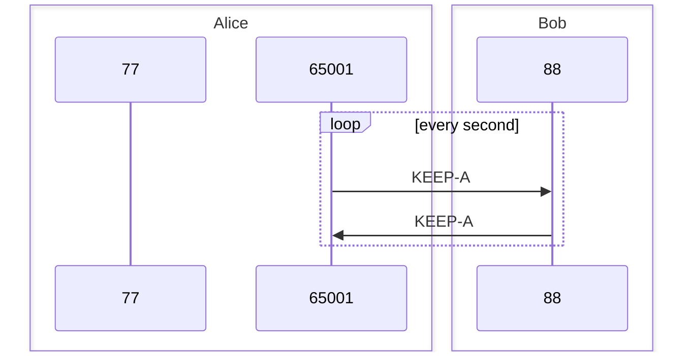
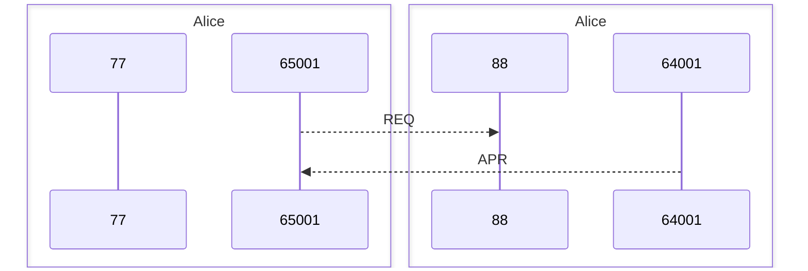
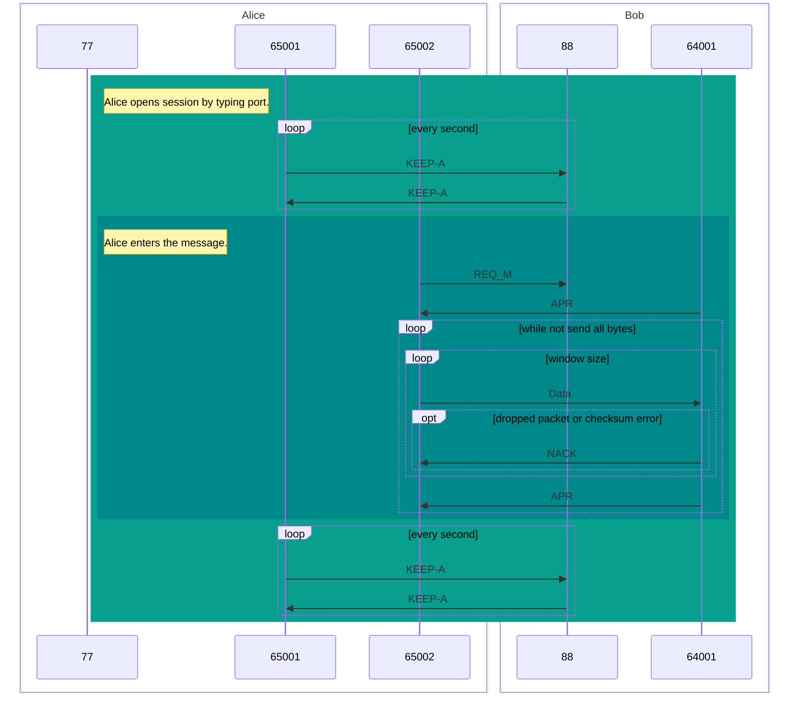
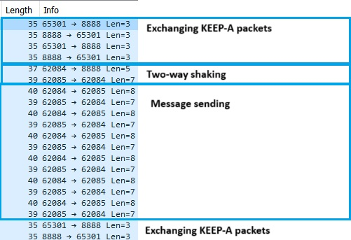

## Exercise

A task was given to create a custom protocol and an application that works with this protocol. The protocol itself must
be designed to work without interruption in an interfering environment.

So after a time, blood and sweat, a protocol emerged:

**Sync 'n' Send Spectacle (SNSS)**

- As a protocol for exchanging messages and files.
- Customizable, according to network needs and its maximum capabilities.
    - By setting `paload_size` and `window_size`.
- Based on UDP.
- Might be useful as a kind of torrent protocol.
    - Because of the way it works, it is possible to receive several files (parts of file) in parallel.
    - And set from which part to start receiving.

## Sync 'n' Send Spectacle (SNSS)

### ARQ Method

No off-the-shelf ARQ method was used for this. It was created on the basis of the best qualities of others.

#### Data (message) sending

- Sender sends an `N` packets and waits for an `ACK`.
    - If `ACK` is not received, it resends the same N packets.
    - Parallely If `NACK` is received, it resends the missing packet (only with `NACK`'s `seq_number`).

- The Receiver receives `N` packets and sends an `ACK`.
    - If the packet is corrupted, it sends a `NACK`.

#### Requesting / Keep-alive

Used a simple request-response principe.

### Header Structure

The header structure itself will not be absolute and will be modified with respect to the type of segment being
forwarded.

| REQ (0x011) | Checksum | Window size | Payload size | Filename |
|-------------|----------|-------------|--------------|----------|
| 3 bits      | 18 bits  | 8 bits      | 11 bits      | ...      |

- Sender sends when it wants to send a file.

---

| REQ_M (0x010) | Checksum | Window size | Payload size | 
|---------------|----------|-------------|--------------|
| 3 bits        | 18 bits  | 8 bits      | 11 bits      |

- Sender sends when it wants to send a message.

---

| Data (0x000) | Checksum | SEQ Number | Data |
|--------------|----------|------------|------|
| 3 bits       | 21 bits  | 32 bits    | ...  |

- Chunk of message (file)

---

| APR (0x100) | Checksum | SEQ Number | 
|-------------|----------|------------|
| 3 bits      | 21 bits  | 32 bits    |

- Acknowledge the received window.
- And as sender understands which window to send next.

---

| NACK (0x101) | Checksum | SEQ Number | 
|--------------|----------|------------|
| 3 bits       | 21 bits  | 32 bits    | 

- Negative acknowledge the received packet.

---

| KEEP-A (0x110) |  
|----------------|
| 3 bits         | 

- If one endpoint sends it to another - another must answer with the same packet to confirm that another endpoint is
  alive and ready for sending the packet.

---

- **SEQ Number**
    - Used to mark segment with unique identification.
    - _32 bits -> 2^32 = 4,294,967,296 segments to send_.
      _1472 - (21+32+3) = 1465_.
      _4,294,967,296 * 1465 ~ **6.25 GB is maximum**_.
- **Checksum**
    - Checksum field is used to avoid any bit errors.
    - _In `ACK` and `NACK` segments used bigger value to handle any error due to simultaneously sending chunks_.
    - _Will be used "Internet
      Checksum":
      [Calculating the Checksum,
      with a taste](https://www.securitynik.com/2015/08/calculating-udp-checksum-with-taste-of_3.html)_.
    - ```python
      def compute_checksum(bits_length, *data):
      checksum = sum(data)

      while checksum.bit_length() > bits_length:
        # Split the checksum into two halves
        mask = (1 << (checksum.bit_length() // 2)) - 1
        low_bits = checksum & mask
        high_bits = checksum >> (checksum.bit_length() // 2)

        checksum = low_bits + high_bits

      return checksum
      ```
- **Window size**
    - How many packets to send at once before send an acknowledgement.
- **Payload size**
    - How many bytes of data are sent in one packet.

### Protocol journey

#### Keep-alive

Simple exchanging of `KEEP-A` packets through timeout is used to keep the connection alive in active (open) session.

A main difference that `KEEP-A` packets are sent through another socket (random port) for optimizing the main thread.



#### "(Two) Three-way handshake"

When connection is established, the sender sends a `REQ` to request sending the message or file.



#### Sending a message

1. Alice enters the `ip:port` of Bob.
    - _Session is opened_.
        - Exchanging of `KEEP-A` packets is started.
2. Alice enters the message.
    - _Sender request to send message (file)_.
        - Exchanging of `KEEP-A` packets is stopped.
    - _Receiver confirms that it is ready to receive the message (file)_.
3. _Message sent and received_.
    - Exchanging of `KEEP-A` packets is started again.





### Error handling

A rather large checksum field is used for this purpose. To control the smallest bit errors.

Depending on the given connection, the sender or receiver resends or requests the message,
if a packet was dropped or received with invalid `checksum`.

## Application

Application was written in `Python 3.10.11` and uses the following libraries:

- `argparse`
- `random`
    - Used to randomly drop or corrupt packets.
- `socket`
- `threading`
    - Used for multi-threading.
        - One thread for receiving packets.
        - One thread for sending packets (based on user-input).
        - etc...
- `time`

### Usage

```cmd
use:
   python main.py [options]
options:
    -p --port [int(default=3141)]      # Select the port to listen on
    -a --ip [str(default=localhost)]   # Select the ip to listen on
    -d --debug [bool(default=False)]   # True/False to enable/disable debug mode
    -b --broken [bool(default=False)]  # True/False to enable/disable randomly corrupting and dropping messages
```

The Application has two states:

- `opnened` - to be able to accept and receives messages.
    - _(when in session the application is still like in opened)_
- `in session` - when the session is opened.
    - When entering `ip` address and `port`.

In `opened` state the application can change:

- `window_size` by entering `>window_size [int]` command.
- `payload_size` by entering `>payload_size [int]` command.

To quit `in session` state enter `>exit` command.

>#### Sending a file
>
>- The file must be in the same directory as a python file.
>- To send a file enter `\[filename]` command `in session` state.

### Code

The application runs in tho main threads:
- `listen`, that listen on keep-alive packets and incoming messages.
    - ```python
        def listen(ip, port):
        while True:
            try:
                data, addr = sock.recvfrom(1472)
    
                fields = open_message(data)
            except BaseException as e:
                print('receiving error', e)
                continue
    
            match fields[0]:
                case Type.REQ.value:
                    receive_message(fields, *addr)
                case Type.REQ_M.value:
                    receive_message(fields, *addr)
                case Type.KEEP_A.value:
                    sock.sendto(create_message(*[Type.KEEP_A.value]), addr)
      ```
- `user_input`, that waits on user input about creating a session and sending a message.
  - ```python
        def user_input():
            while True:
                try:
                    _socket = input('enter ip and port number:\n')
        
                   ...
        
                session(ip, port)
    
        def session(ip, port):

    timer = None

    def send_keep_alive():
        nonlocal timer, alive_connection
        sock_keep_alive.sendto(create_message(*[Type.KEEP_A.value]), (ip, port))

        try:
            data, addr = sock_keep_alive.recvfrom(1472)
        except BaseException as e:
            print('exception on keep-alive connection ', e)
            alive_connection = False
        else:
            alive_connection = True
            timer = threading.Timer(1.0, send_keep_alive)
            timer.start()
    
    ...
    
    def send_message(ip, port, data, filename=None):    
        ...
    
        while alive_connection:
            message = input('enter message:\n')
            
            try:
                if message.startswith('\\'):
                    with open(message[1:], 'rb') as file:
                        send_message(ip, port, file.read(), int.from_bytes(message[1:].encode('utf-8'), 'big'))
                        continue
    
                send_message(ip, port, message.encode('utf-8'))
            except BaseException as e:
                print(e)
                break
    
            send_keep_alive()
    ```

---

## linked W

- [Learning by practicing: Calculating the TCP Checksum, with a taste of scapy + Wireshark (security.com)](https://www.securitynik.com/2015/08/calculating-udp-checksum-with-taste-of_3.html)
- [Python, how to read bytes from a file and save it? — Stack Overflow](https://stackoverflow.com/questions/6787233/python-how-to-read-bytes-from-file-and-save-it)