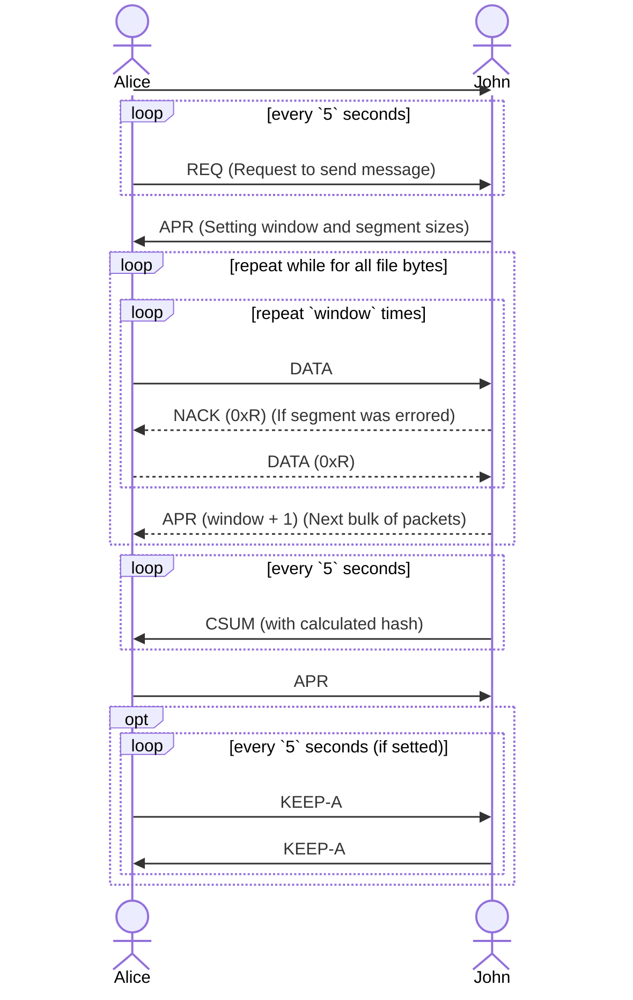

## Conversation example

This conversation will include messages from both sides. Sending multiple files (with different segment sizes).

```mermaid
sequenceDiagram
    actor Alice
    actor John
    
    Alice ->> John: 
    
    

    loop every `5` seconds
        Alice ->> John: REQ (Request to send message)
    end

    John ->> Alice: APR (Setting window and segment sizes)

    loop repeat while for all file bytes
        loop repeat `window` times
            Alice ->> John: DATA
            John -->> Alice: NACK (0xR) (If segment was errored)
            Alice -->> John: DATA (0xR)
        end

        John -->> Alice: APR (window + 1) (Next bulk of packets)
    end

    loop every `5` seconds
        John ->> Alice: CSUM (with calculated hash)
    end

    Alice ->> John: APR

    opt
        loop every `5` seconds (if setted)
            Alice ->> John: KEEP-A
            John ->> Alice: KEEP-A
        end
    end
```